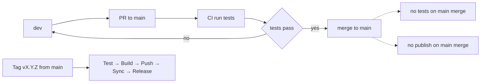

# Branch Strategy and GitHub Protection Rules

## Overview

This repository uses a simple, resilient two-branch strategy designed to keep production stable while enabling fast iteration:

- main: always production-ready, deployable at all times
- dev: the integration branch for daily development and feature work

The normal flow of changes is:

- Develop on dev
- Open a pull request (PR) from dev into main
- Automated tests must pass on the PR
- Merge into main when ready for production
- Optionally create a version tag from main to publish a release

The flow at a glance:



## Branch descriptions

### main

- Production-ready code only; this branch is protected
- Merges to main do not trigger CI (tests/publish are skipped; validation occurred on the PR)
- Version tags (for example v1.0.0) are created from main and trigger the full pipeline: test → build → push → sync → release

### dev

- All day-to-day development happens in dev
- Pushing commits to dev runs the test workflow in [.github/workflows/test.yml](.github/workflows/test.yml)
- Feature branches are optional; for a solo developer, committing directly to dev is acceptable, since main is protected and PRs still require green tests

## CI/CD workflow

- Push to dev
  - CI runs the test workflow (job name: Test) defined in [.github/workflows/test.yml](.github/workflows/test.yml)
  - No images are published from dev
- Open PR from dev to main
  - CI runs the same tests on the PR
  - All required checks must pass
  - The PR branch must be up to date with main before the merge button becomes available
- Merge to main
  - No workflows are triggered (tests/publish are skipped because validation already happened on the PR)
- Push a version tag (for example v1.2.3)
  - The publish workflow [.github/workflows/docker-publish.yml](.github/workflows/docker-publish.yml) runs a full, sequential pipeline:
    - test → build → push → sync README → create GitHub Release
  - Multi-arch images are pushed with latest and semver tags (for example v1.2.3)
  - A GitHub Release is created with autogenerated notes

Example: creating and pushing a release tag from main

```sh
git checkout main
git pull
git tag -a v1.2.3 -m 'Release v1.2.3'
git push origin v1.2.3
```

## GitHub branch protection configuration (main)

Configure protections on main to enforce the workflow and prevent accidental direct pushes:

1. Open the repository on GitHub
2. Go to Settings → Branches → Add branch protection rule
3. Branch name pattern: main
4. Enable the following required settings:
   - ✅ Require a pull request before merging
   - ✅ Require approvals (1 approval recommended for a single developer; self-approval is acceptable)
   - ✅ Require status checks to pass before merging
     - Add required status check: Test
   - ✅ Require branches to be up to date before merging
   - ✅ Do not allow bypassing the above settings (enforce for administrators as well)
5. Optional but recommended:
   - ✅ Require linear history
   - ✅ Require signed commits (if you use commit signing)
6. Save changes

Notes

- If Test does not appear in the list of selectable checks yet, merge or trigger the workflow once so GitHub learns the check name, then return and mark it as required
- Do not protect dev, so that day-to-day work remains unblocked; protection is focused on main

## Best practices

- Do all daily development on dev
- Open PRs from dev into main when you are ready to promote to production
- Keep PRs small and focused; smaller changes are easier to review and revert if needed
- Ensure all tests pass before merging
- Use semantic versioning for tags: vMAJOR.MINOR.PATCH (for example v1.0.0, v1.1.0, v1.1.1)
- Create and push tags from main only

## Single developer workflow

This repository is maintained by a single developer, so the process can be streamlined while keeping safeguards:

- Work directly on dev, committing and pushing freely
- When ready for production, open a PR from dev to main
- Let CI run; fix any failures until the required Test check is green
- Self-approve the PR (1 required approval) and merge; protections still prevent accidental direct pushes to main and ensure tests are green
- From main, create a semantic version tag to publish a release and versioned image

## Useful commands

Set up local tracking branches

```sh
git fetch origin
git checkout -B dev origin/dev
git checkout -B main origin/main
```

Keep dev current and push changes

```sh
git checkout dev
git pull --rebase
# make changes, commit
git push
```

Open a PR to main using GitHub CLI (optional)

```sh
gh pr create --base main --head dev --fill
```

## References

- Test workflow: [.github/workflows/test.yml](.github/workflows/test.yml)
- Docker publish workflow: [.github/workflows/docker-publish.yml](.github/workflows/docker-publish.yml)