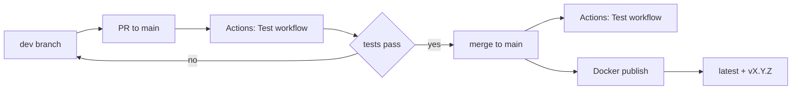

# Developer Guide: Working with the Two-Branch Strategy

This guide shows how to work day‑to‑day with the main/dev workflow, from first‑time setup to shipping a release. It complements the high‑level overview in [docs/BRANCH_STRATEGY.md](docs/BRANCH_STRATEGY.md) and the CI/CD definitions in [.github/workflows/test.yml](.github/workflows/test.yml) and [.github/workflows/docker-publish.yml](.github/workflows/docker-publish.yml).

## At a glance



---

## 1) Quick start

Prerequisites
- Git 2.40+ and a GitHub account with access to the repository
- Optional: GitHub CLI gh for creating PRs from the terminal

Initial repository setup

```bash
# 1) Clone and enter the repo
git clone https://github.com/firbykirby/udp-broadcast-relay.git
cd udp-broadcast-relay

# 2) Configure your identity (used in commits)
git config user.name "Your Name"
git config user.email "you@example.com"

# Recommended quality-of-life settings (local to this repo)
git config pull.rebase true           # rebase pulls to keep history linear
git config push.autoSetupRemote true  # auto-create upstream on first push

# 3) Fetch and create local tracking branches for dev and main
git fetch origin
git checkout -B dev origin/dev
git checkout -B main origin/main

# 4) Set default branch for new shells
git checkout dev
```

Optional: commit signing
- If you use signed commits, enable it now:
  - Generate a key and follow GitHub instructions
  - Then run: git config commit.gpgsign true

---

## 2) Daily development workflow

1. Start work from dev

```bash
git checkout dev
git pull --rebase            # bring your local dev up to date
```

2. Make changes and commit

```bash
# edit files...
git add -A
git commit -m "feat: short, meaningful summary of the change"
```

3. Push to dev (triggers CI tests)

```bash
git push                      # Actions runs the Test workflow on dev
# See workflow definition: [.github/workflows/test.yml](.github/workflows/test.yml)
```

4. Review test results
- Open the repository on GitHub → Actions tab → select the latest Test run on branch dev
- Inspect any failing step logs and artifacts

5. When ready for production, create a PR to main

Using GitHub web
- Open Pull requests → New pull request
- Base: main, Compare: dev → Create pull request

Using GitHub CLI gh

```bash
gh pr create --base main --head dev --fill
```

6. Review and approve PR
- For a single‑developer repo, self‑approval is acceptable and enforced via branch protection
- All required checks must be green, and the PR must be up to date with main

7. Merge to main (publishes Docker on success)
- Merging to main re‑runs tests and, on success, publishes images via [.github/workflows/docker-publish.yml](.github/workflows/docker-publish.yml)
- Tags published include latest and version tags when present

---

## 3) Creating a release

Releases are created by tagging main with a semantic version. Only tag from main.

Semantic Versioning
- MAJOR x.0.0: incompatible changes, rewires behavior or removes support
- MINOR 1.x.0: backward‑compatible features or improvements
- PATCH 1.2.x: backward‑compatible fixes, docs, or refactors

Commands

```bash
# Prepare: ensure main is current
git checkout main
git pull

# Choose a version and create an annotated tag
VERSION=v1.2.3
git tag -a "$VERSION" -m "Release $VERSION"

# Push the tag to trigger publishing
git push origin "$VERSION"
```

What happens next
- GitHub Actions builds and publishes multi‑arch Docker images
- A GitHub Release is automatically created with release notes generated from commit messages
- The latest tag is always published; a version tag vX.Y.Z is added when you push a tag

Docker Hub
- Images are available at: https://hub.docker.com/r/firbykirby/udp-broadcast-relay

---

## 4) Common scenarios

Scenario 1: Making a quick fix on dev

```bash
git checkout dev
git pull --rebase
# edit files...
git add -A
git commit -m "fix: correct typo in README"
git push
# Open PR dev -> main when tests pass
```

Scenario 2: Working on a new feature

Option A: work directly on dev

```bash
git checkout dev
git pull --rebase
# implement feature...
git add -A
git commit -m "feat: add XYZ"
git push
```

Option B: use a temporary feature branch (advanced)

```bash
git checkout dev
git pull --rebase
git switch -c feat/my-feature   # create from dev
# implement feature...
git add -A
git commit -m "feat: add XYZ"
git push -u origin feat/my-feature

# Optionally open a PR feat/my-feature -> dev for review
```

Scenario 3: Creating a release

```bash
git checkout main
git pull
VERSION=v1.2.3
git tag -a "$VERSION" -m "Release $VERSION"
git push origin "$VERSION"
# Watch Actions and confirm images on Docker Hub
```

Scenario 4: Handling failed tests

```bash
# From the failing branch (usually dev)
# 1) Open Actions → failed run → read logs/artifacts
# 2) Fix the issue locally, commit, and push again
git add -A
git commit -m "fix: address CI failure in tests"
git push
# CI re-runs automatically
```

Scenario 5: Updating dev after main has moved forward

```bash
# Bring dev up to date with main before continuing work
git checkout dev
git fetch origin
git merge origin/main           # or: git rebase origin/main
# Resolve any conflicts, then:
git add -A
git commit                      # if merge commit is needed
git rebase --continue           # if you chose rebase
git push
```

---

## 5) Troubleshooting

Tests fail on dev
- Open Actions → Test workflow run for branch dev
- Read the failing step logs; fix locally and push again
- If failures involve container build, ensure Dockerfile changes build locally: docker build . 

Tests fail on PR to main
- Ensure the PR branch is up to date with main
- Merge main into dev, resolve conflicts, push; CI will re‑run
- Keep iterations small to isolate failures

Merge conflicts

```bash
# Update dev with the latest main, resolve conflicts
git checkout dev
git fetch origin
git merge origin/main     # or: git rebase origin/main
# edit conflicted files, then:
git add -A
git commit                # or: git rebase --continue
git push
```

Update a PR after feedback
- Push more commits to the source branch of the PR (dev or your feature branch)
- Reply to comments, mark as resolved, and re‑request review if needed
- CI will re‑run automatically on push

---

## 6) Git commands reference

| Task | Command |
| --- | --- |
| Switch to dev | git checkout dev |
| Update current branch | git pull --rebase |
| Stage all changes | git add -A |
| Commit | git commit -m "feat: message" |
| Push current branch | git push |
| Create PR via CLI | gh pr create --base main --head dev --fill |
| Tag a release | git tag -a v1.2.3 -m "Release v1.2.3" |
| Push a tag | git push origin v1.2.3 |
| Merge main into dev | git merge origin/main |
| Rebase dev onto main | git rebase origin/main |

---

## 7) CI/CD status checks

View workflow runs in GitHub Actions
- Repository → Actions → select workflow name Test or Publish Docker image
- Filter by branch (dev or main) or by event (push, pull_request, tag)

Understand results
- Green check: all steps passed, you can proceed
- Red X: read failing step logs; fix and push to rerun
- Artifacts: vulnerability reports or logs may be attached to runs

Docker images
- Published to Docker Hub: https://hub.docker.com/r/firbykirby/udp-broadcast-relay
- Tags: latest and vX.Y.Z for tagged releases

---

## 8) Best practices reminder

- Never push directly to main; protections enforce PR + checks
- Always ensure tests are green before merging
- Write meaningful, conventional commit messages
- Keep dev up to date with main regularly
- Keep PRs small and focused

Related documents
- Branch strategy and protections: [docs/BRANCH_STRATEGY.md](docs/BRANCH_STRATEGY.md)
- Test workflow definition: [.github/workflows/test.yml](.github/workflows/test.yml)
- Docker publish workflow: [.github/workflows/docker-publish.yml](.github/workflows/docker-publish.yml)