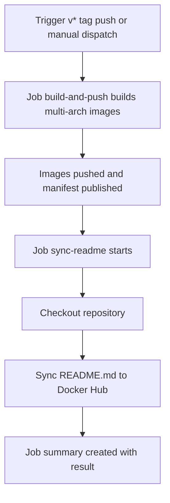

# Docker Hub README Synchronization

Keep Docker Hub documentation in lockstep with your repository by automatically syncing README.md after successful image publishes.

- Workflow file: [.github/workflows/docker-publish.yml](.github/workflows/docker-publish.yml)
- Architecture deep dive: [docs/ARCHITECTURE_README_SYNC.md](docs/ARCHITECTURE_README_SYNC.md)
- Docker Hub repository: https://hub.docker.com/r/firbykirby/udp-broadcast-relay

Note
This document is user-focused. For design rationale, security reviews, and alternative approaches, see [docs/ARCHITECTURE_README_SYNC.md](docs/ARCHITECTURE_README_SYNC.md).


## 1. Overview

The CI pipeline automatically synchronizes the repository README.md to Docker Hub after Docker image publication. This ensures the Docker Hub page always reflects the current documentation without manual updates.

Benefits
- Single source of truth: Update [README.md](README.md) once; both GitHub and Docker Hub display the same content.
- Release integrity: README updates occur only after a successful image publish.
- Zero manual drift: Eliminates stale or divergent Docker Hub descriptions.
- Auditable: All syncs are traceable in GitHub Actions run history.

When the sync runs
- On push of version tags matching v* (for example v1.2.3).
- On manual trigger from the Actions tab via workflow_dispatch.
- Only after the build-and-push job has completed successfully.


## 2. How It Works

High-level flow
- The workflow [.github/workflows/docker-publish.yml](.github/workflows/docker-publish.yml) defines a second job named sync-readme.
- This job:
  - waits for the multi-arch image publish to complete (needs: build-and-push),
  - checks the event type to ensure it is push or workflow_dispatch,
  - checks out the repo and then syncs README.md to Docker Hub using peter-evans/dockerhub-description@v4.

Sequence



Multi-architecture build coordination
- The build job uses docker/build-push-action to create a single multi-arch manifest for linux/amd64 and linux/arm64.
- The sync-readme job only runs after the build-and-push job succeeds, guaranteeing all architectures have been published before documentation updates.

Idempotency and safety
- Re-running the workflow is safe. Updating the README with identical content results in no changes on Docker Hub.
- The action compares content and may skip unnecessary updates.
- The sync job is time-bounded with a 5-minute timeout.
- Concurrency is configured at the workflow level to serialize runs per ref (branch/tag), preventing overlapping updates.


## 3. Prerequisites

GitHub repository prerequisites
- GitHub Actions enabled.
- The workflow file present at [.github/workflows/docker-publish.yml](.github/workflows/docker-publish.yml).

Docker Hub prerequisites
- A Docker Hub repository must exist: firbykirby/udp-broadcast-relay.
- A Docker Hub Access Token with permissions to update repository descriptions (read/write scope).

Required GitHub secrets
- DOCKERHUB_USERNAME: Docker Hub username (for example firbykirby).
- DOCKERHUB_TOKEN: Docker Hub Access Token (recommended over password).

Permissions used by the sync job
- Job-level permissions: contents: read (to read [README.md](README.md)).
- No additional write permissions to the GitHub repository are required.


## 4. Setup Instructions

Step 1 — Create a Docker Hub Access Token
- Sign in to Docker Hub.
- Navigate to Account Settings → Security.
- Create a new Access Token with read/write scope for repository description updates.
- Copy the token value.

Step 2 — Add GitHub Secrets
Option A: Using GitHub UI
1. Go to your repository → Settings → Secrets and variables → Actions → New repository secret.
2. Add:
   - Name: DOCKERHUB_USERNAME, Value: your Docker Hub username.
   - Name: DOCKERHUB_TOKEN, Value: the Access Token you created.

Option B: Using GitHub CLI

```bash
# Set from local variables (recommended)
export DOCKERHUB_USERNAME='your-username'
export DOCKERHUB_TOKEN='your-access-token'

gh secret set DOCKERHUB_USERNAME --body "$DOCKERHUB_USERNAME"
gh secret set DOCKERHUB_TOKEN --body "$DOCKERHUB_TOKEN"
```

Step 3 — Verify the workflow file exists
- Confirm [.github/workflows/docker-publish.yml](.github/workflows/docker-publish.yml) is present in the default branch.

Step 4 — Initial test
Option A: Test with manual workflow_dispatch
- From the repository’s Actions tab, select Publish Docker image (multi-arch).
- Click Run workflow to trigger a manual run.
- The workflow builds images and then runs sync-readme to update Docker Hub.

Option B: Test with a temporary tag

```bash
git tag v0.0.0-test
git push origin v0.0.0-test
# After validation, delete the tag:
git tag -d v0.0.0-test
git push origin :refs/tags/v0.0.0-test
```

Verification
- Open the Actions tab, select the latest run of Publish Docker image (multi-arch), and inspect the sync-readme job.
- Visit the Docker Hub page and confirm the README is updated:
  https://hub.docker.com/r/firbykirby/udp-broadcast-relay


## 5. Usage

Automatic sync behavior
- On version tag push v*: The full pipeline runs for releases (test → build → push → sync → release).

Manual sync
- From the repository’s Actions tab, select Publish Docker image (multi-arch), then click Run workflow.
- The workflow will build images and perform the README sync.

Viewing sync results in GitHub Actions UI
- Open the run details, then the sync-readme job.
- Key steps:
  - Log sync attempt: Captures event, ref, SHA, and target repository.
  - Sync README to Docker Hub: Runs the update action.
  - Log sync success or Log sync failure: Emits notices or errors.
  - Generate job summary: Adds a run summary with result and links.

Tip: If the sync step failed but images were built successfully, you can use GitHub’s Re-run failed jobs for the same run to retry the sync without rebuilding images. Using workflow_dispatch will rebuild images because the build-and-push job runs on manual dispatch.


## 6. Troubleshooting

Where to find logs
- Actions → Select run → sync-readme job.
- Examine the output of:
  - Log sync attempt
  - Sync README to Docker Hub
  - Log sync failure
  - Generate job summary (also visible in the Summary tab for the run)

Common issues and resolutions
- 401 Unauthorized
  - Cause: Invalid DOCKERHUB_USERNAME or DOCKERHUB_TOKEN.
  - Fix: Recreate the Docker Hub Access Token, update the GitHub secret, and re-run.
- 404 Repository not found
  - Cause: Docker Hub repository firbykirby/udp-broadcast-relay does not exist or wrong namespace.
  - Fix: Create the repository on Docker Hub or correct the repository name in the workflow.
- 429 Rate limit exceeded
  - Cause: Excessive API calls in a short window.
  - Fix: Wait for the limit to reset; re-run later.
- README file not found
  - Cause: [README.md](README.md) missing or path changed.
  - Fix: Ensure README.md exists at the repository root or update the readme-filepath input in the workflow.

Interpreting error messages
- The Log sync failure step prints a concise checklist of likely misconfigurations (secrets, repo existence, README presence, Docker Hub status).
- For platform-wide issues, check Docker Hub status: https://status.docker.com.

Manual retry procedures
- Re-run failed jobs to retry only the sync step on the same run artifacts.
- Re-run all jobs or use workflow_dispatch to perform a fresh build and sync.
- For transient Docker Hub issues, wait and retry; the action includes limited built-in retry logic.


## 7. Technical Details

Action used
- peter-evans/dockerhub-description@v4 (pinned to a specific commit SHA in the workflow for supply-chain safety).
- Action repository: https://github.com/peter-evans/dockerhub-description

Workflow structure (abridged)
- File: [.github/workflows/docker-publish.yml](.github/workflows/docker-publish.yml)
- Jobs:
  - build-and-push
    - Builds and pushes multi-arch images for linux/amd64 and linux/arm64.
    - Derives tags via docker/metadata-action (latest and semver).
    - Logs in to Docker Hub using DOCKERHUB_USERNAME and DOCKERHUB_TOKEN.
    - Runs Trivy scan and uploads SARIF.
  - sync-readme
    - needs: build-and-push (runs only after successful publish).
    - Trigger gated to push or workflow_dispatch events.
    - Uses peter-evans/dockerhub-description with:
      - username: ${{ secrets.DOCKERHUB_USERNAME }}
      - password: ${{ secrets.DOCKERHUB_TOKEN }}
      - repository: firbykirby/udp-broadcast-relay
      - readme-filepath: ./README.md
      - short-description: brief summary for Docker Hub listing.

Error handling and logging
- Failure in the sync step fails the sync job (continue-on-error not used).
- Dedicated logging steps emit:
  - notice on success,
  - structured error guidance on failure,
  - a job summary for quick run inspection.

Timeouts and retries
- Job timeout: 5 minutes to prevent hangs.
- The action includes basic retry handling for transient network/API errors.
- For persistent failures, prefer Re-run failed jobs or manual workflow_dispatch after remediation.


## 8. Maintenance

Updating the README content
- Edit [README.md](README.md) in the repository.
- On the next eligible run (push to main, release tag, or manual run), the Docker Hub README will update automatically.

Monitoring sync health
- Periodically check recent workflow runs for failures.
- Review the generated job summary on each run for a quick status indicator.
- Consider enabling GitHub Action notifications or external alerts.

When to manually trigger a sync
- After rotating DOCKERHUB_TOKEN or changing secrets.
- After major README restructuring where you want an immediate refresh.
- After recovering from Docker Hub outages or known action issues.

Operational tips
- Keep DOCKERHUB_TOKEN rotated regularly (for example, every 90 days).
- Keep the action pinned and review for upstream security updates.
- If you change repository or branch defaults, validate the workflow triggers and the path to README.md.


## 9. Reference

- Workflow file: [.github/workflows/docker-publish.yml](.github/workflows/docker-publish.yml)
- Architecture details: [docs/ARCHITECTURE_README_SYNC.md](docs/ARCHITECTURE_README_SYNC.md)
- Root README: [README.md](README.md)
- Docker Hub repository: https://hub.docker.com/r/firbykirby/udp-broadcast-relay
- Action used: https://github.com/peter-evans/dockerhub-description


## 10. FAQ

Does the manual workflow_dispatch rebuild images?
- Yes. The build-and-push job runs on manual dispatch, so images will be rebuilt then the README will sync. If you only need to retry the README sync for a given run where the images were built successfully, use Re-run failed jobs on that run instead of a new workflow_dispatch.

Will relative links in README.md work on Docker Hub?
- Yes. Docker Hub typically renders relative GitHub links as absolute links to the repository on the default branch. After your first sync, spot-check a few links on Docker Hub to confirm.

What happens if the README content is unchanged?
- The action detects no-op updates and avoids unnecessary API calls, keeping the process efficient and idempotent.