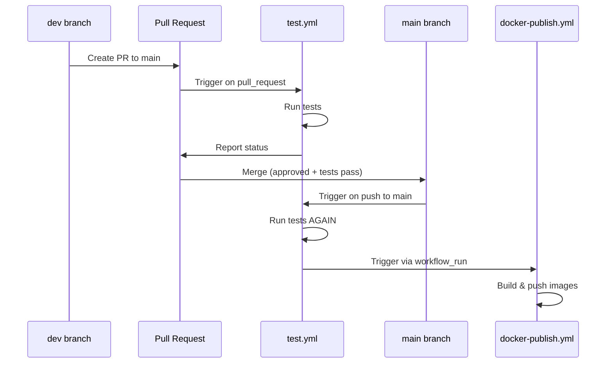
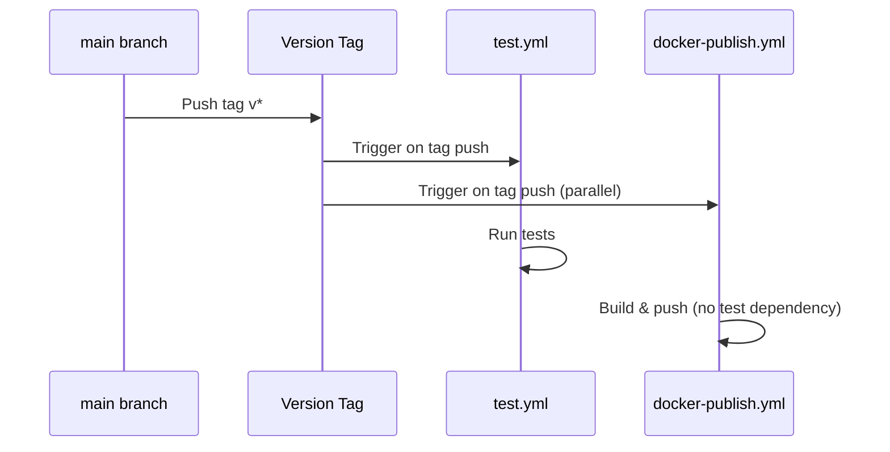
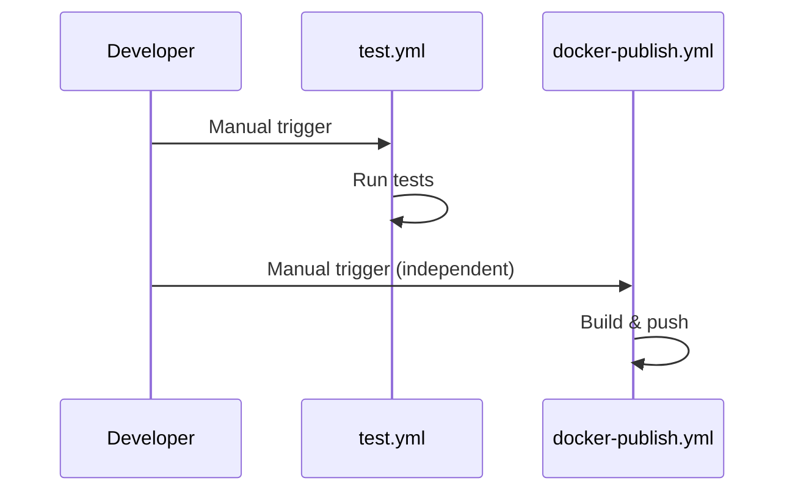
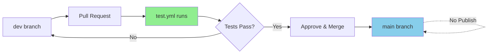
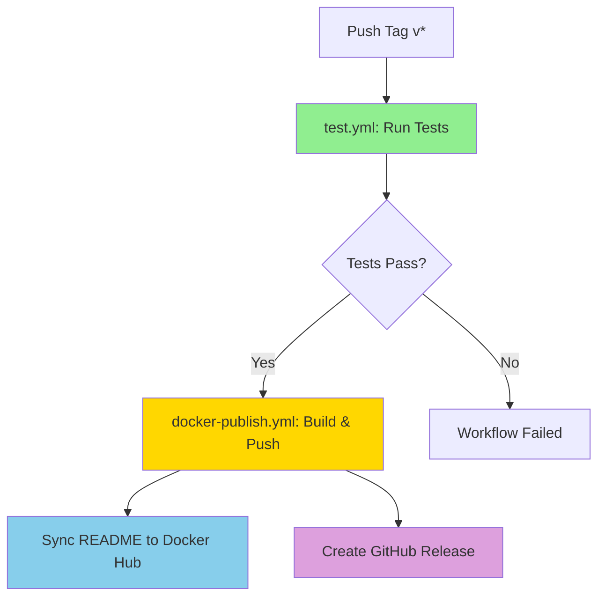
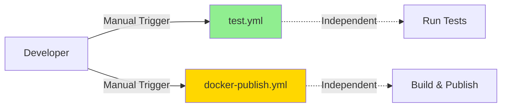
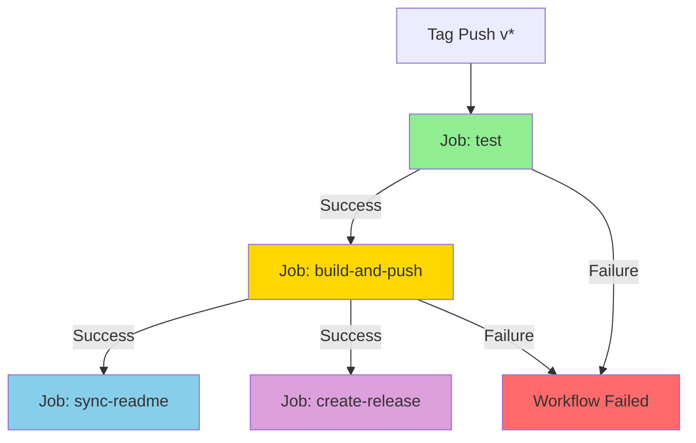
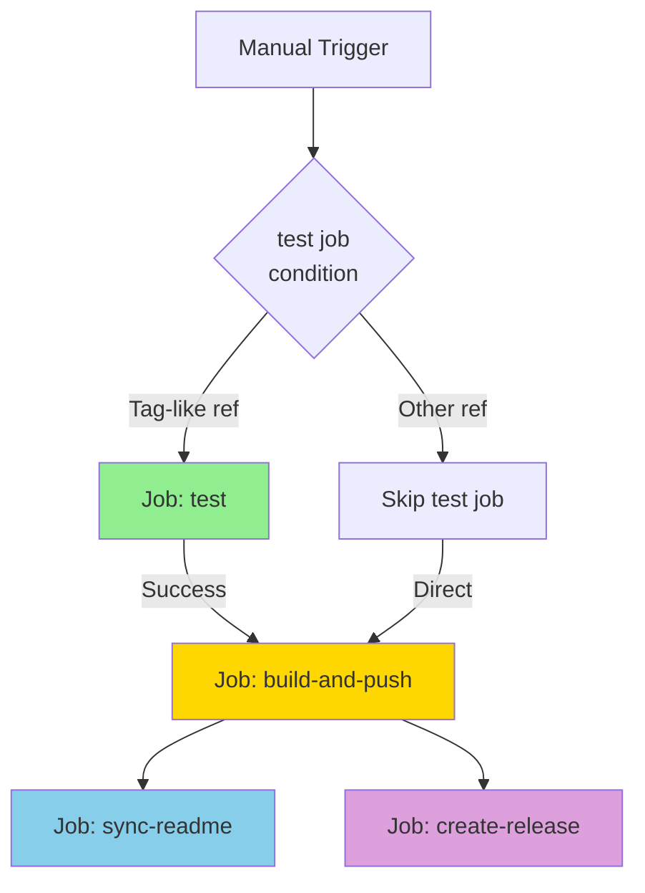

# GitHub Workflow Dependency Chain - Architecture Design

**Project:** UDP Broadcast Relay  
**Document Version:** 1.0  
**Date:** 2025-10-16  
**Status:** Design Complete - Ready for Implementation

---

## Executive Summary

This document presents a comprehensive analysis of the current GitHub Actions workflow structure and proposes a refactored dependency chain architecture that eliminates redundant test execution while maintaining code quality gates. The new design establishes clear separation between PR validation, version releases, and manual operations.

### Key Changes
- **Eliminate redundant testing** when PRs merge to main (tests already validated during PR)
- **Remove automatic publishing** on main branch merges
- **Full pipeline for tags** (test → build → push → sync → release)
- **Independent manual triggers** without automatic chaining

---

## Table of Contents

1. [Current State Analysis](#current-state-analysis)
2. [Identified Problems](#identified-problems)
3. [Three-Scenario Design](#three-scenario-design)
4. [Proposed Architecture](#proposed-architecture)
5. [Workflow File Changes](#workflow-file-changes)
6. [Migration Strategy](#migration-strategy)
7. [Testing Plan](#testing-plan)

---

## Current State Analysis

### Existing Workflow Files

#### 1. `.github/workflows/test.yml`

**Current Triggers:**
```yaml
on:
  pull_request:
    branches: ["main"]
  push:
    branches: ["main", "dev"]
    tags: ["v*"]
  workflow_dispatch:
```

**Jobs:**
- `test`: Builds test image, runs functional tests, performs security scanning with Trivy

**Concurrency:**
```yaml
concurrency:
  group: test-${{ github.ref }}
  cancel-in-progress: true
```

**Purpose:** Validates code changes through automated testing and security scanning

---

#### 2. `.github/workflows/docker-publish.yml`

**Current Triggers:**
```yaml
on:
  push:
    tags: ["v*"]
  workflow_dispatch:
  workflow_run:
    workflows: ["Test"]
    types: [completed]
    branches: ["main"]
```

**Jobs:**
1. `build-and-push`: Multi-arch Docker image build and publish
2. `create-release`: GitHub release creation (tags only)
3. `sync-readme`: Docker Hub README synchronization

**Concurrency:**
```yaml
concurrency:
  group: docker-publish-${{ github.ref }}
  cancel-in-progress: false
```

**Purpose:** Publishes production artifacts and synchronizes documentation

---

### Current Workflow Execution Paths

#### Path 1: Pull Request Flow


**Problem:** Tests run twice (PR + main merge), images auto-publish on every merge

---

#### Path 2: Version Tag Flow


**Problem:** Tests and publish run in parallel, no dependency chain, potential to publish untested code

---

#### Path 3: Manual Dispatch


**Status:** Works as intended (independent operations)

---

## Identified Problems

### Problem 1: Redundant Test Execution on Main Merges

**Current Behavior:**
1. PR opened from dev to main → `test.yml` runs
2. Tests pass, PR approved and merged
3. Merge to main → `test.yml` runs AGAIN
4. Test completion → `docker-publish.yml` triggered via `workflow_run`

**Impact:**
- Wastes CI minutes (tests run twice for same commit)
- Delays deployment (unnecessary test re-run)
- No value added (code already validated during PR)

**Root Cause:**
- `test.yml` triggers on `push: branches: ["main"]`
- `docker-publish.yml` triggers on `workflow_run` from Test

---

### Problem 2: Unwanted Automatic Publishing

**Current Behavior:**
- Every merge to main automatically publishes Docker images
- No control over when images are released

**Impact:**
- Images published even when not ready for release
- Cannot accumulate multiple PRs before publishing
- Forces frequent releases for minor changes

**Root Cause:**
- `workflow_run` trigger in `docker-publish.yml` on main branch

---

### Problem 3: Parallel Execution for Tags

**Current Behavior:**
- Pushing version tag triggers `test.yml` AND `docker-publish.yml` simultaneously
- No dependency between test results and publishing

**Impact:**
- Risk of publishing untested code if tests are slow
- No guarantee images match tested code
- Race condition potential

**Root Cause:**
- Both workflows trigger independently on tag push
- No job dependency chain for tag scenario

---

### Problem 4: Inconsistent Testing Coverage

**Scenario Comparison:**

| Scenario | Tests Run | Images Published | Desired Behavior |
|----------|-----------|------------------|------------------|
| PR merge to main | 2x (PR + merge) | ✅ Auto | ❌ Skip tests, skip publish |
| Version tag push | 1x (parallel) | ✅ Auto | ✅ Sequential (test → publish) |
| Manual dispatch | 0-1x (optional) | 0-1x (optional) | ✅ Independent |

---

## Three-Scenario Design

### Scenario 1: Pull Request Merging to Main

**Desired Flow:**


**Requirements:**
- ✅ Tests run during PR validation
- ❌ Tests DO NOT run when PR merges to main
- ❌ Images DO NOT auto-publish on merge to main
- ✅ Main remains clean and protected

**Rationale:**
- Code already validated during PR review
- Redundant testing wastes resources
- Publishing controlled by explicit version tags

---

### Scenario 2: Version Tags on Main

**Desired Flow:**


**Requirements:**
- ✅ Tests run first (full validation)
- ✅ Build/push only if tests pass
- ✅ README sync after successful publish
- ✅ GitHub release created with notes
- ✅ All jobs in single workflow for atomic execution

**Rationale:**
- Version tags represent official releases
- Must guarantee tested code in published images
- Full pipeline ensures quality and documentation sync

---

### Scenario 3: Manual Workflow Dispatches

**Desired Flow:**


**Requirements:**
- ✅ Each workflow can be triggered independently
- ❌ No automatic chaining between workflows
- ✅ Useful for ad-hoc testing or hotfix publishing
- ✅ Manual control over both test and publish operations

**Rationale:**
- Maximum flexibility for maintainer operations
- Supports edge cases (emergency patches, documentation fixes)
- No automatic dependencies prevent unexpected cascades

---

## Proposed Architecture

### Design Principles

1. **Explicit Over Implicit**: Workflows trigger only when explicitly intended
2. **No Redundancy**: Each test execution must provide unique value
3. **Atomic Releases**: Version tags execute complete pipeline atomically
4. **Independent Manual Ops**: Manual triggers remain independent
5. **Fail-Fast**: Publish jobs depend on test success

---

### Modified Workflow Structure

#### 1. `test.yml` - Test & Validation Workflow

**New Triggers:**
```yaml
on:
  pull_request:
    branches: ["main"]
  push:
    branches: ["dev"]
  workflow_dispatch:
```

**Changes:**
- ❌ **REMOVED:** `push: branches: ["main"]` - eliminates redundant testing on merge
- ❌ **REMOVED:** `push: tags: ["v*"]` - testing moved into docker-publish.yml
- ✅ **KEPT:** `pull_request` - validates PR changes
- ✅ **KEPT:** `push: branches: ["dev"]` - validates dev commits
- ✅ **KEPT:** `workflow_dispatch` - allows manual testing

**Jobs:** (unchanged)
- `test`: Build, test, security scan

**Purpose:** Validates code during development and PR review

---

#### 2. `docker-publish.yml` - Build, Publish & Release Workflow

**New Triggers:**
```yaml
on:
  push:
    tags: ["v*"]
  workflow_dispatch:
```

**Changes:**
- ❌ **REMOVED:** `workflow_run` trigger - eliminates auto-publish on main merges
- ✅ **KEPT:** `push: tags: ["v*"]` - official releases
- ✅ **KEPT:** `workflow_dispatch` - manual publishing

**Jobs:** (with new dependency chain)

1. **test** (NEW)
   - Runs full test suite
   - Only executes for tag pushes
   - Uses same steps as test.yml
   - Must pass before subsequent jobs

2. **build-and-push** (MODIFIED)
   - Depends on `test` job for tag pushes
   - Builds multi-arch images
   - Pushes to Docker Hub
   - Runs security scan

3. **sync-readme** (unchanged)
   - Depends on `build-and-push`
   - Syncs README to Docker Hub

4. **create-release** (unchanged)
   - Depends on `build-and-push`
   - Creates GitHub release (tags only)

**Purpose:** Publishes production artifacts with full validation

---

### Dependency Chain Visualization

#### For Version Tags (v*)


#### For Manual Dispatch


---

## Workflow File Changes

### File: `.github/workflows/test.yml`

**Changes Required:**

1. **Modify Triggers Section:**
```yaml
# BEFORE
on:
  pull_request:
    branches: ["main"]
  push:
    branches: ["main", "dev"]
    tags: ["v*"]
  workflow_dispatch:

# AFTER
on:
  pull_request:
    branches: ["main"]
  push:
    branches: ["dev"]
  workflow_dispatch:
```

2. **No Job Changes Required**
   - All job definitions remain identical
   - Concurrency settings unchanged

**Impact:**
- Workflow will no longer trigger on main branch pushes
- Workflow will no longer trigger on tag pushes
- Workflow continues to validate PRs and dev commits

---

### File: `.github/workflows/docker-publish.yml`

**Changes Required:**

1. **Modify Triggers Section:**
```yaml
# BEFORE
on:
  push:
    tags: ["v*"]
  workflow_dispatch:
  workflow_run:
    workflows: ["Test"]
    types: [completed]
    branches: ["main"]

# AFTER
on:
  push:
    tags: ["v*"]
  workflow_dispatch:
```

2. **Add New Test Job:**
```yaml
jobs:
  test:
    runs-on: ubuntu-latest
    if: startsWith(github.ref, 'refs/tags/v')
    permissions:
      contents: read
      security-events: write
    steps:
      - name: Checkout
        uses: actions/checkout@v4

      - name: Set up Docker Buildx
        uses: docker/setup-buildx-action@v3

      - name: Build test image
        uses: docker/build-push-action@v6
        with:
          context: .
          load: true
          tags: udp-broadcast-relay-redux:test-${{ github.sha }}
          platforms: linux/amd64
          cache-from: type=gha
          cache-to: type=gha,mode=max

      - name: Make test script executable
        run: chmod +x build-and-test.sh

      - name: Run test script
        run: TEST_IMAGE=udp-broadcast-relay-redux:test-${{ github.sha }} ./build-and-test.sh

      - name: Run Trivy vulnerability scan
        uses: aquasecurity/trivy-action@0.28.0
        with:
          scan-type: 'image'
          image-ref: 'udp-broadcast-relay-redux:test-${{ github.sha }}'
          format: 'sarif'
          output: 'trivy-results.sarif'
          severity: 'CRITICAL,HIGH,MEDIUM,LOW'
          exit-code: 0

      - name: Upload SARIF results
        uses: github/codeql-action/upload-sarif@v3
        if: always()
        with:
          sarif_file: trivy-results.sarif
          category: container-scan

      - name: Generate human-readable Trivy report
        if: always()
        uses: aquasecurity/trivy-action@0.28.0
        with:
          image-ref: udp-broadcast-relay-redux:test-${{ github.sha }}
          format: 'table'
          output: 'trivy-report.txt'
          severity: 'CRITICAL,HIGH,MEDIUM,LOW'

      - name: Upload Trivy scan report
        uses: actions/upload-artifact@v4
        if: always()
        with:
          name: trivy-scan-report
          path: trivy-report.txt
          retention-days: 30

      - name: Upload test logs on failure
        uses: actions/upload-artifact@v4
        if: failure()
        with:
          name: test-logs
          path: |
            *.log
          retention-days: 7
```

3. **Modify build-and-push Job:**
```yaml
# BEFORE
build-and-push:
  runs-on: ubuntu-latest
  if: |
    github.event_name == 'workflow_dispatch' && github.ref == 'refs/heads/main' ||
    (github.event_name == 'workflow_run' && github.event.workflow_run.conclusion == 'success') ||
    startsWith(github.ref, 'refs/tags/v')

# AFTER
build-and-push:
  runs-on: ubuntu-latest
  needs: test
  if: |
    github.event_name == 'workflow_dispatch' ||
    (startsWith(github.ref, 'refs/tags/v') && needs.test.result == 'success')
```

4. **No Changes to sync-readme Job**
   - Condition already filters correctly
   - Dependency on build-and-push remains

5. **No Changes to create-release Job**
   - Condition already filters for tags
   - Dependency on build-and-push remains

**Impact:**
- Workflow will no longer trigger on main branch merges
- Tag pushes now run tests first via new test job
- Build and push depends on test success for tags
- Manual dispatches can skip tests (for documentation updates)

---

## Migration Strategy

### Phase 1: Pre-Implementation Validation

**Tasks:**
1. Review proposed changes with stakeholders
2. Validate no breaking changes to external integrations
3. Confirm branch protection rules are compatible
4. Back up current workflow files

**Duration:** 1 day

---

### Phase 2: Implementation

**Tasks:**
1. Create feature branch for workflow changes
2. Modify `.github/workflows/test.yml` per specifications
3. Modify `.github/workflows/docker-publish.yml` per specifications
4. Update documentation references
5. Create PR for review

**Duration:** 2 hours

---

### Phase 3: Testing

**Test Scenarios:**

| Test # | Scenario | Expected Result | Validation |
|--------|----------|-----------------|------------|
| T1 | Push to dev branch | test.yml runs, no publish | Check Actions tab |
| T2 | Create PR dev→main | test.yml runs on PR | Check PR checks |
| T3 | Merge PR to main | No workflows trigger | Check Actions tab |
| T4 | Push version tag v0.0.0-test | test → build → sync → release | Check all jobs |
| T5 | Manual trigger test.yml | test.yml runs independently | Check Actions tab |
| T6 | Manual trigger docker-publish.yml | Publishes without chaining | Check Actions tab |

**Duration:** 1 day

---

### Phase 4: Documentation Updates

**Files to Update:**

1. **docs/BRANCH_STRATEGY.md**
   - Update CI/CD workflow section
   - Add note about no auto-publish on main merges
   - Update version tag flow diagram

2. **docs/DEVELOPER_GUIDE.md**
   - Update workflow descriptions
   - Add note about explicit tag pushing for releases
   - Update troubleshooting section

3. **docs/IMPLEMENTATION_CHECKLIST.md**
   - Update workflow verification steps
   - Add new testing scenarios

4. **README.md** (if applicable)
   - Update workflow badges if present
   - Update deployment section

**Duration:** 2 hours

---

### Phase 5: Monitoring

**Post-Deploy Monitoring:**
- Monitor first PR merge (should not trigger workflows)
- Monitor first tag push (should run full pipeline)
- Check CI/CD minutes consumption (should decrease)
- Validate Docker Hub images match expected tags

**Duration:** Ongoing for 1 week

---

## Testing Plan

### Unit Tests (Workflow Syntax)

```bash
# Validate YAML syntax
yamllint .github/workflows/test.yml
yamllint .github/workflows/docker-publish.yml

# Validate workflow references
gh workflow view test.yml
gh workflow view docker-publish.yml
```

---

### Integration Tests

#### Test 1: PR Validation (Unchanged Behavior)
```bash
# Create test branch
git checkout -b test/workflow-pr
echo "test" >> test-file.txt
git add test-file.txt
git commit -m "test: workflow validation"
git push origin test/workflow-pr

# Create PR via GitHub CLI
gh pr create --base dev --head test/workflow-pr --title "Test PR workflow"

# Expected: test.yml runs on PR
# Verify: GitHub Actions → test.yml run for PR
```

#### Test 2: Main Branch Protection (New Behavior)
```bash
# Merge test PR to dev
gh pr merge --squash

# Update main from dev
git checkout main
git pull origin main

# Merge dev to main
gh pr create --base main --head dev --title "Test main merge"
gh pr merge --squash

# Expected: NO workflows trigger after merge
# Verify: GitHub Actions → no new runs after merge
```

#### Test 3: Version Tag Pipeline (New Behavior)
```bash
# Create test tag
git checkout main
git pull
git tag -a v0.0.0-test -m "Test tag workflow"
git push origin v0.0.0-test

# Expected: 
# 1. docker-publish.yml triggers
# 2. test job runs first
# 3. build-and-push depends on test
# 4. sync-readme and create-release follow
# Verify: GitHub Actions → check job dependencies
```

#### Test 4: Manual Dispatch (Unchanged Behavior)
```bash
# Trigger test workflow manually
gh workflow run test.yml

# Expected: test.yml runs independently
# Verify: GitHub Actions → manual run appears

# Trigger publish workflow manually
gh workflow run docker-publish.yml

# Expected: docker-publish.yml runs independently
# Verify: GitHub Actions → manual run appears
```

---

### Rollback Plan

**If issues detected:**

1. **Immediate Rollback:**
```bash
# Revert workflow changes
git checkout main
git revert <merge-commit-sha>
git push origin main
```

2. **Restore Old Workflows:**
```bash
# Copy from backup or previous commit
git checkout <previous-commit> -- .github/workflows/
git commit -m "Revert workflow changes"
git push origin main
```

3. **Notify Team:**
- Post in repository discussions
- Update relevant issues/PRs
- Document rollback reason

**Time to Rollback:** < 5 minutes

---

## Summary of Changes

### What Changes

| Component | Current State | New State | Reason |
|-----------|--------------|-----------|--------|
| test.yml triggers | Runs on main pushes | Does NOT run on main pushes | Eliminate redundancy |
| test.yml triggers | Runs on tag pushes | Does NOT run on tag pushes | Consolidate into publish workflow |
| docker-publish.yml triggers | Runs on Test completion | Does NOT run on Test completion | Prevent auto-publish |
| docker-publish.yml jobs | No test job | Includes test job for tags | Ensure tested releases |
| Tag push flow | Parallel test + publish | Sequential test → publish | Guarantee quality |

---

### What Stays the Same

- ✅ PR validation continues to run tests
- ✅ Dev branch commits trigger tests
- ✅ Manual dispatches work independently
- ✅ Branch protection rules compatible
- ✅ Docker Hub publishing functionality
- ✅ README synchronization
- ✅ GitHub release creation
- ✅ Security scanning with Trivy

---

## Benefits of New Architecture

### 1. Resource Efficiency
- **Before:** 2x test runs per PR merge (PR + main push)
- **After:** 1x test run per PR merge (PR only)
- **Savings:** ~50% reduction in redundant CI minutes

### 2. Controlled Releases
- **Before:** Every main merge triggers automatic publish
- **After:** Publishes only via explicit version tags
- **Benefit:** Accumulate changes before releasing

### 3. Quality Assurance
- **Before:** Tag publishes could race with tests
- **After:** Tests must pass before publish
- **Benefit:** Guaranteed tested code in releases

### 4. Clear Intent
- **Before:** Implicit workflows via workflow_run
- **After:** Explicit triggers per scenario
- **Benefit:** Easier to understand and debug

### 5. Maintainability
- **Before:** Complex conditional logic across workflows
- **After:** Simple, scenario-based triggers
- **Benefit:** Reduced cognitive load for maintenance

---

## Workflow Comparison Tables

### Trigger Comparison

| Event | test.yml (Before) | test.yml (After) | docker-publish.yml (Before) | docker-publish.yml (After) |
|-------|-------------------|------------------|---------------------------|--------------------------|
| PR to main | ✅ Runs | ✅ Runs | ❌ No | ❌ No |
| Push to main | ✅ Runs | ❌ **Removed** | ✅ Via workflow_run | ❌ **Removed** |
| Push to dev | ✅ Runs | ✅ Runs | ❌ No | ❌ No |
| Push tag v* | ✅ Runs | ❌ **Removed** | ✅ Runs | ✅ Runs (with test) |
| Manual dispatch | ✅ Runs | ✅ Runs | ✅ Runs | ✅ Runs |

---

### Job Execution Comparison

#### Scenario: Merge PR to main

| Stage | Before | After | Change |
|-------|--------|-------|--------|
| PR validation | test.yml runs | test.yml runs | ✅ Unchanged |
| Merge to main | test.yml runs | — | ✅ Removed |
| After merge | docker-publish.yml runs | — | ✅ Removed |
| **Total workflows** | **3 runs** | **1 run** | ✅ 67% reduction |

---

#### Scenario: Push version tag

| Stage | Before | After | Change |
|-------|--------|-------|--------|
| Tag push | test.yml runs | — | ✅ Moved to publish |
| Tag push | docker-publish.yml runs | docker-publish.yml runs | ✅ Enhanced |
| Test execution | ✅ Parallel | ✅ Sequential (first) | ✅ Enforced dependency |
| Build/push | ✅ Parallel | ✅ After test success | ✅ Quality gate |
| **Total workflows** | **2 parallel** | **1 with chain** | ✅ Better control |

---

## Appendix A: Complete Workflow Files

### Modified test.yml
```yaml
name: Test

on:
  pull_request:
    branches: ["main"]
  push:
    branches: ["dev"]
  workflow_dispatch:

concurrency:
  group: test-${{ github.ref }}
  cancel-in-progress: true

permissions:
  contents: read
  security-events: write

jobs:
  test:
    runs-on: ubuntu-latest
    steps:
      - name: Checkout
        uses: actions/checkout@v4

      - name: Set up Docker Buildx
        uses: docker/setup-buildx-action@v3

      - name: Build test image
        uses: docker/build-push-action@v6
        with:
          context: .
          load: true
          tags: udp-broadcast-relay-redux:test-${{ github.sha }}
          platforms: linux/amd64
          cache-from: type=gha
          cache-to: type=gha,mode=max

      - name: Make test script executable
        run: chmod +x build-and-test.sh

      - name: Run test script
        run: TEST_IMAGE=udp-broadcast-relay-redux:test-${{ github.sha }} ./build-and-test.sh

      - name: Run Trivy vulnerability scan
        uses: aquasecurity/trivy-action@0.28.0
        with:
          scan-type: 'image'
          image-ref: 'udp-broadcast-relay-redux:test-${{ github.sha }}'
          format: 'sarif'
          output: 'trivy-results.sarif'
          severity: 'CRITICAL,HIGH,MEDIUM,LOW'
          exit-code: 0

      - name: Upload SARIF results
        uses: github/codeql-action/upload-sarif@v3
        if: always()
        with:
          sarif_file: trivy-results.sarif
          category: container-scan

      - name: Generate human-readable Trivy report
        if: always()
        uses: aquasecurity/trivy-action@0.28.0
        with:
          image-ref: udp-broadcast-relay-redux:test-${{ github.sha }}
          format: 'table'
          output: 'trivy-report.txt'
          severity: 'CRITICAL,HIGH,MEDIUM,LOW'

      - name: Upload Trivy scan report
        uses: actions/upload-artifact@v4
        if: always()
        with:
          name: trivy-scan-report
          path: trivy-report.txt
          retention-days: 30

      - name: Upload test logs on failure
        uses: actions/upload-artifact@v4
        if: failure()
        with:
          name: test-logs
          path: |
            *.log
          retention-days: 7
```

### Modified docker-publish.yml (Key sections)
```yaml
name: Publish Docker image (multi-arch)

on:
  push:
    tags: ["v*"]
  workflow_dispatch:

concurrency:
  group: docker-publish-${{ github.ref }}
  cancel-in-progress: false

jobs:
  test:
    runs-on: ubuntu-latest
    if: startsWith(github.ref, 'refs/tags/v')
    permissions:
      contents: read
      security-events: write
    steps:
      # [Same steps as test.yml test job]

  build-and-push:
    runs-on: ubuntu-latest
    needs: test
    if: |
      github.event_name == 'workflow_dispatch' ||
      (startsWith(github.ref, 'refs/tags/v') && needs.test.result == 'success')
    permissions:
      contents: read
      packages: write
      security-events: write
    steps:
      # [Existing build-and-push steps unchanged]

  create-release:
    runs-on: ubuntu-latest
    needs: build-and-push
    if: startsWith(github.ref, 'refs/tags/v')
    permissions:
      contents: write
    steps:
      # [Existing create-release steps unchanged]

  sync-readme:
    runs-on: ubuntu-latest
    needs: build-and-push
    if: success() && (github.event_name == 'push' || github.event_name == 'workflow_dispatch')
    timeout-minutes: 5
    permissions:
      contents: read
    steps:
      # [Existing sync-readme steps unchanged]
```

---

## Appendix B: Decision Log

| Decision | Rationale | Alternatives Considered |
|----------|-----------|------------------------|
| Remove workflow_run trigger | Prevents unwanted auto-publish | Keep but add complex conditionals |
| Move test job to docker-publish.yml | Atomic release pipeline | Keep in test.yml and use workflow_run |
| Skip tests on main merge | Already validated in PR | Re-run for safety (rejected: waste) |
| Keep independent manual triggers | Maximum flexibility | Always chain workflows (rejected: rigid) |
| Use job dependencies for tags | Enforce quality gate | Allow parallel (rejected: risky) |

---

## Appendix C: FAQ

**Q: Why not keep workflow_run but add conditions?**  
A: Complex conditionals are error-prone and hard to maintain. Explicit triggers are clearer.

**Q: What if we want to publish from main without a tag?**  
A: Use manual workflow_dispatch on docker-publish.yml from main branch.

**Q: How do we handle hotfixes?**  
A: Create tag directly from main, full pipeline runs. Or use manual dispatch.

**Q: Will this break existing branch protections?**  
A: No, PR validation still requires test.yml to pass before merge.

**Q: What about documentation-only changes?**  
A: Use manual dispatch of docker-publish.yml to sync README without rebuilding images.

**Q: Can we still test main branch code?**  
A: Yes, use manual workflow_dispatch on test.yml from main branch.

---

## Document Revision History

| Version | Date | Author | Changes |
|---------|------|--------|---------|
| 1.0 | 2025-10-16 | Architect Mode | Initial comprehensive design |

---

**END OF DOCUMENT**