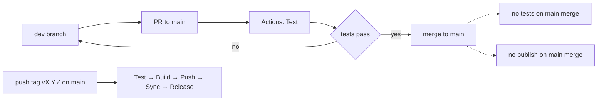
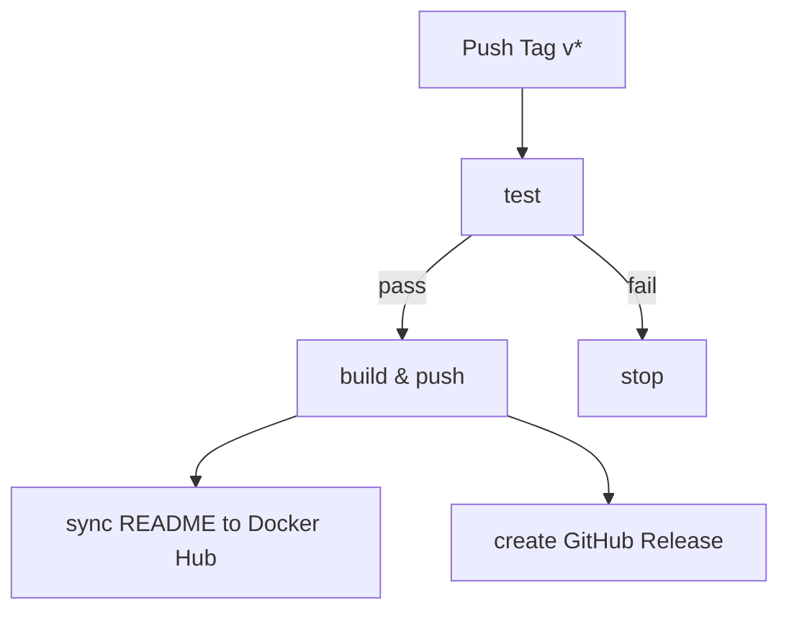

# Developer Guide

This guide covers how to work day-to-day with the main/dev workflow, from first-time setup to shipping a release.

## Branch strategy overview

This repository uses a two-branch strategy:

- **main**: Production-ready code only. Protected. Merges do not trigger CI.
- **dev**: All day-to-day development. Pushes trigger the test workflow.

The normal flow: develop on dev → PR to main → tests pass on PR → merge to main → tag vX.Y.Z from main to publish.



### GitHub branch protection (main)

Configure protections on main to enforce the workflow:

1. Go to Settings → Branches → Add branch protection rule
2. Branch name pattern: `main`
3. Enable:
   - ✅ Require a pull request before merging
   - ✅ Require status checks to pass before merging (required check: **Test**)
   - ✅ Require branches to be up to date before merging
   - ✅ Do not allow bypassing the above settings
4. Optional: Require linear history, require signed commits

**Notes:**
- If **Test** doesn't appear in the list yet, trigger the workflow once so GitHub learns the check name
- Do not protect dev; protection is focused on main

---

## Quick start

Prerequisites: Git 2.40+, GitHub account with repo access, optional: GitHub CLI `gh`

```bash
# Clone and enter the repo
git clone https://github.com/firbykirby/udp-broadcast-relay.git
cd udp-broadcast-relay

# Configure identity
git config user.name "Your Name"
git config user.email "you@example.com"

# Recommended settings
git config pull.rebase true           # rebase pulls to keep history linear
git config push.autoSetupRemote true  # auto-create upstream on first push

# Fetch and create tracking branches
git fetch origin
git checkout -B dev origin/dev
git checkout -B main origin/main
git checkout dev   # set default branch for new shells
```

Optional: enable signed commits with `git config commit.gpgsign true`.

---

## Daily development workflow

1. **Start work from dev:**
   ```bash
   git checkout dev
   git pull --rebase
   ```

2. **Make changes and commit:**
   ```bash
   git add -A
   git commit -m "feat: short, meaningful summary"
   ```

3. **Push to dev (triggers CI tests):**
   ```bash
   git push   # Actions runs the Test workflow
   ```

4. **When ready for production, create a PR to main:**
   ```bash
   gh pr create --base main --head dev --fill
   ```
   Or use GitHub web: Pull requests → New pull request (Base: main, Head: dev)

5. **PR validation:**
   - Tests run automatically on the PR
   - For a single-developer repo, self-approval is acceptable
   - All required checks must be green, PR must be up to date with main

6. **Merge to main (no CI on merge):**
   - PR validation already ran; merging to main does not trigger workflows
   - To publish, create a version tag from main (see below)

---

## Creating a release

Releases are created by tagging **main** with a semantic version.

```bash
git checkout main
git pull

VERSION=v1.2.3
git tag -a "$VERSION" -m "Release $VERSION"
git push origin "$VERSION"
```

What happens next:
- Full pipeline runs: test → build → push → sync README → create GitHub Release
- Multi-arch images (linux/amd64, linux/arm64) published to Docker Hub
- GitHub Release created automatically with notes from commit messages

**Semantic versioning:**
- **MAJOR** x.0.0: Incompatible changes
- **MINOR** 1.x.0: Backward-compatible features
- **PATCH** 1.2.x: Backward-compatible fixes

Docker Hub: https://hub.docker.com/r/firbykirby/udp-broadcast-relay

---

## CI/CD workflow behavior and manual triggers

### Three scenarios

**Scenario 1: PR merge to main**
- Tests already ran on the PR; merging to main does not run tests or publish images

**Scenario 2: Version tags on main**
- Full pipeline in [.github/workflows/docker-publish.yml](.github/workflows/docker-publish.yml): test → build → push → sync → release

**Scenario 3: Manual dispatches**
- Trigger [.github/workflows/test.yml](.github/workflows/test.yml) or [.github/workflows/docker-publish.yml](.github/workflows/docker-publish.yml) independently from the Actions tab

### Manual triggers

```bash
# Trigger tests manually
gh workflow run .github/workflows/test.yml

# Trigger publish pipeline manually (no tag required)
gh workflow run .github/workflows/docker-publish.yml
```

### Dependency chain for version tags



### When tests run vs. skip

| Trigger | Tests run? | Images published? |
|---------|------------|-------------------|
| Push to dev | ✅ Yes (test.yml) | ❌ No |
| PR to main | ✅ Yes (test.yml) | ❌ No |
| Merge to main | ❌ No | ❌ No |
| Push tag v* | ✅ Yes (docker-publish.yml) | ✅ Yes |
| Manual dispatch (test.yml) | ✅ Yes | ❌ No |
| Manual dispatch (docker-publish.yml) | ✅ Yes | ✅ Yes |

---

## Common scenarios

### Making a quick fix

```bash
git checkout dev
git pull --rebase
# edit files...
git add -A
git commit -m "fix: correct typo"
git push
# Open PR dev -> main when tests pass
```

### Working on a new feature

**Option A: Work directly on dev**

```bash
git checkout dev
git pull --rebase
# implement feature...
git add -A
git commit -m "feat: add XYZ"
git push
```

**Option B: Use a temporary feature branch (advanced)**

```bash
git checkout dev
git pull --rebase
git switch -c feat/my-feature   # create from dev
# implement feature...
git add -A
git commit -m "feat: add XYZ"
git push -u origin feat/my-feature
# Optionally open a PR feat/my-feature -> dev for review
```

### Handling failed tests

```bash
# Open Actions → failed run → read logs/artifacts
# Fix the issue locally, commit, and push again
git add -A
git commit -m "fix: address CI failure"
git push
```

### Updating dev after main has moved forward

```bash
git checkout dev
git fetch origin
git merge origin/main   # or: git rebase origin/main
# Resolve any conflicts
git add -A
git commit              # if merge commit is needed
git push
```

---

## Troubleshooting

**Tests fail on dev:**
- Open Actions → Test workflow run for branch dev
- Read the failing step logs; fix locally and push again
- If failures involve container build, test locally: `docker build .`

**Tests fail on PR to main:**
- Ensure the PR branch is up to date with main
- Merge main into dev, resolve conflicts, push
- Keep iterations small to isolate failures

**Merge conflicts:**
- Update dev with the latest main, resolve conflicts
- If you need to rerun after a failed workflow_dispatch, use "Re-run failed jobs" to retry only the sync step

---

## Related documents

- **[DOCKERHUB_README_SYNC.md](DOCKERHUB_README_SYNC.md)**: Docker Hub README synchronization technical details
- Test workflow: [.github/workflows/test.yml](.github/workflows/test.yml)
- Publish workflow: [.github/workflows/docker-publish.yml](.github/workflows/docker-publish.yml)

*Note: The detailed CI/CD design rationale and implementation checklists have been archived. For historical design documentation, see git history.*
